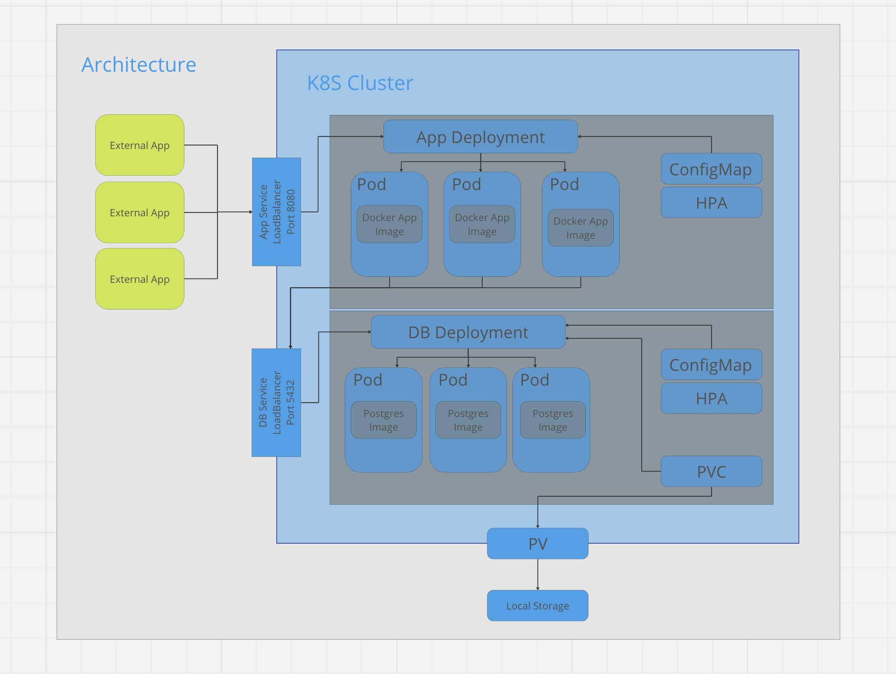

# Food Challenge

## Prerequisites

Ensure you have the following installed on your local machine:

- Docker
- Java JDK

## Setting Up Your Local Environment

1. **Clone the repository:**
    First, clone the `food-challenge` repository to your local machine. You can do this by running the following command in your terminal:

    ```bash
    git clone git@github.com:dvdonadelli/food-challenge.git
    ```

    Navigate to the project directory:

    ```bash
    cd food-challenge
    ```

2. **Configure and run k8s:**
    In order to run the application locally, a few steps need to be performed:
   
   1. **Install minikube:** First, go to https://minikube.sigs.k8s.io/docs/start/ and install it according to your OS.
   2. **Start Cluster:** After correctly install run minikube to start a new k8s cluster, using the following command.
      ```bash
       minikube start
       ```
   3. **Start database:** With the cluster correctly running, start the DB pods using:
       ```bash
       kubectl apply -f ./k8s/db
       ```
   4. **Start the application:** Then, you will need to start the application by running:
       ```bash
       kubectl apply -f ./k8s/app
       ```
   5. **Expose Pods:** Since Minikube does not expose automatically the services ips, you will need to run:
      ```bash
       minikube tunnel
      ```
That's it! Your local development environment is set up, and you should be able to test our application.

## Swagger or Postman

To get a better view of the API endpoint, you can access the swagger endpoint in the following path:

    localhost:8080/swagger-ui/index.html

or

[](https://app.getpostman.com/run-collection/8557906-a98b0740-f272-48a8-8b2b-373d6440ae9c?action=collection%2Ffork&source=rip_markdown&collection-url=entityId%3D8557906-a98b0740-f272-48a8-8b2b-373d6440ae9c%26entityType%3Dcollection%26workspaceId%3Da6351687-ea84-4d74-bbd6-491183b035ed)
    
## K8s Architecture


    